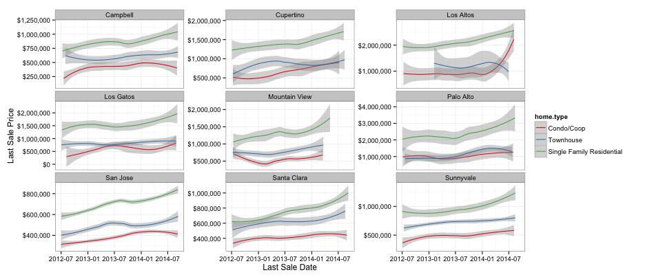

## Motivation & Datasets

In this shiny app, I explore the historical real estate transactions in Santa Clara County, California, U.S.A. (often referred to as "Silicon Valley") from 07/01/2011 to 09/01/2014. 

There are many real estate websites (such as Redfin and Zillow) that can search for houses for sale or historial transaction records, based on certain criteria; however, when the records are plotted on a map, there is no existing site that could map the variables (sale price, lot size, etc) with the symbols attributes (color, size, etc.) I set out to build this shiny app to satisfy this functionality. 

The raw data is downloaded from real estate websites. I started out with the Santa Clara county area because this happened to be the area that I live in. The data set only includes 10,000 transactions, which represents less than 30% of all the trasactions during this time frame. The reduction in sample size was necessary to speed up the rendering of circles on map.

--- .class #id 

## User Interface

Each circle on the map indicates a particular transaction at a specific address. There are two attributes, color and size, for the circle; each attribute can be mapped to one of the four variables: Home type, Sale Price, Square Feet, and Price per Sq.Ft.

The side panel also contains three additional graphs:
- Histogram of last sale price
- Histogram of price per sq.ft
- Smooth fit (Loess) of the last sale price versus date, broken down by home type.

The graphs are reactive to the map boundaries - the data used in these three graphs only include the visilbe houses on the map.

--- .class #id 

## Time-Series Trends of Selected Cities


```r
p <- ggplot(data = subset(d, !home.type %in% c("Multi-Family", "Mobile/Manufactured Home") & !city %in% c("Los Altos Hills", "Milpitas", "East Palo Alto", "Saratoga"))) + theme_bw()
p <- p + geom_smooth(aes(x = as.Date(last.sale.date), y = last.sale.price, color = home.type), method = 'loess')
p <- p + facet_wrap( ~ city, scales = "free_y")
```


 

--- .class #id 


## Potential Future Improvements

There are a few ideas that I have regrading future improvements to this app:

1. Adding more variables that can be mapped to attributes.

2. Adding the option to plot density plots, as opposed to using circles to represent individual entries, to scale to larger number of entries. (Currently the app becomes very slow at above 10,000 entries.)

3. Adding functionality to explore the price trends versus time, based on variables from user input (ex: bedrooms/baths, year built, etc)

Please visit the [shinapps.io](http://ikding.shinyapps.io/Santa-Clara-County-Housing-Explorer/) site for the interactive version of this shiny app, and direct questions and feedbacks to [ikding@gmail.com](mailto:ikding@gmail.com). Thanks!

